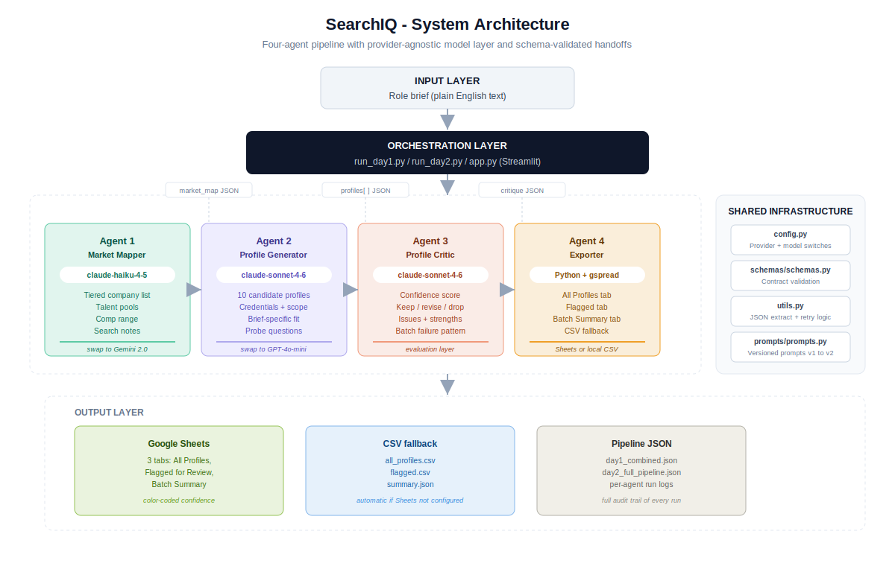
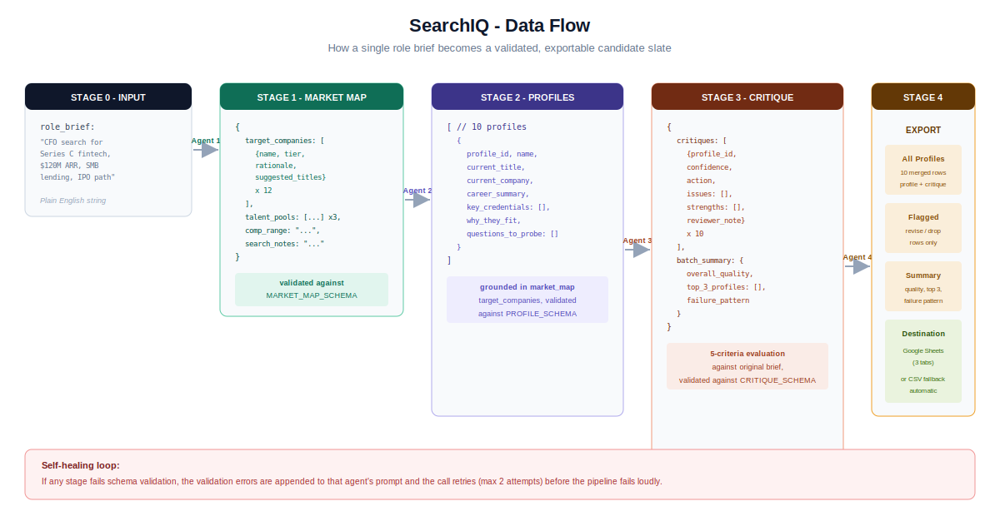
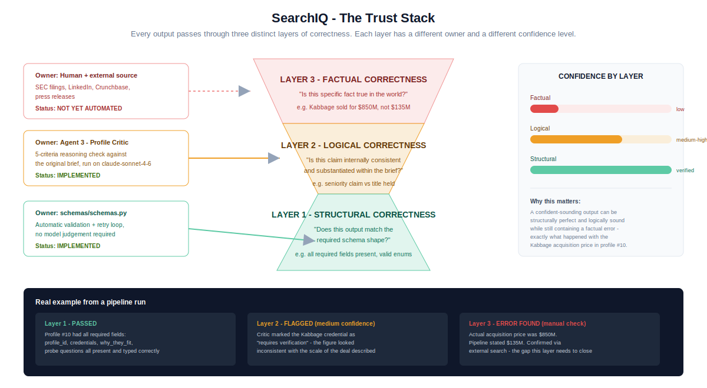

# SearchIQ

**A multi-agent AI pipeline that turns a plain-English hiring brief into an evaluated, export-ready candidate slate.**


---

## Problem statement

Executive and technical research teams spend hours on three repetitive steps for every search: mapping which companies and talent pools to target, drafting candidate profiles that match the brief, and then manually reviewing those profiles for quality before anything goes to a client or hiring manager.

SearchIQ automates that loop end to end, then adds a step most AI tools skip entirely: a dedicated evaluation agent that audits the AI's own output, flags weak or unsubstantiated claims, and tells you exactly what to fix before you ship it.

---

## What it does, in one line per stage

- **Market mapping**: takes a role brief and returns tiered target companies, talent pools, and a comp range
- **Profile generation**: produces a full slate of candidate profiles grounded in that market map
- **Output evaluation**: critiques every profile against the brief, scores confidence, and recommends keep, revise, or drop
- **Export**: merges everything into a formatted Google Sheet or CSV, ready to share

---

## Tech stack

- **AI models**
  - `claude-haiku-4-5` for fast, broad market synthesis
  - `claude-sonnet-4-6` for structured generation and evaluative reasoning
  - optional: `gemini-2.0-flash` and `gpt-4o-mini` as drop-in provider swaps
- **Python SDKs**
  - `anthropic` for Claude
  - `google-genai` for Gemini
  - `openai` for GPT
  - `gspread` and `google-auth` for Sheets export
- **Application layer**
  - `streamlit` for the interactive demo UI
  - `python-dotenv` for environment-based configuration
- **Core Python**
  - `json` for inter-agent data contracts
  - `csv` for export fallback
  - `logging` for per-run audit trails

---

## How it is implemented

- **Agent architecture**: four independent agents, each a single-responsibility Python class with its own prompt, validation rules, and retry logic
- **Provider abstraction**: every agent reads its model and provider from one config file, so swapping Claude for Gemini or GPT is a two-line change, not a rewrite
- **Schema contracts**: every agent's output is validated against an explicit JSON schema before it is passed downstream; failed validation triggers a corrective retry with the error fed back into the prompt
- **Prompt versioning**: every prompt exists in the codebase as v1 and v2, with the v1 limitations documented inline, so the iteration reasoning is visible, not just the final result
- **Evaluation layer**: the critic agent applies five explicit criteria (title match, accountability ownership, credential specificity, brief-specific fit, domain translation risk) and produces both per-item and batch-level findings
- **Graceful degradation**: if Google Sheets credentials are not configured, export falls back to CSV automatically with no pipeline failure

---

## Architecture



---

## Data flow



---

## The trust stack (what makes this different)

Most AI pipelines stop at "the model returned valid JSON." SearchIQ treats that as the easy 10 percent of the problem. The diagram below is the core idea of the project: every output is correct in up to three different senses, and each sense needs a different kind of check.



A real example from a pipeline run: a generated profile passed schema validation completely (every field present, correctly typed), and passed the critic's logical review (the claim was internally consistent with the rest of the profile), but stated a company acquisition price that was factually wrong by a factor of six. The critic flagged it as "needs verification." Closing that final gap with an automated fact-check layer is the next milestone for this project.

---

## Prompt engineering, shown not just claimed

Every prompt in `prompts/prompts.py` exists in two versions. The v1 prompts are kept as comments alongside an explanation of what went wrong. Example, condensed:

```text
v1 (market mapper): "Return 10-15 target companies for this role brief"
  -> kept returning generic Fortune 500 names regardless of brief

v2: added a tier field (primary/secondary/stretch), a suggested_titles
    array per company, and an explicit constraint:
    "prefer $500M-$5B companies unless the brief specifies otherwise"
  -> output became specific and immediately actionable
```

---

## Running it

```bash
git clone https://github.com/AaronFChristian/searchiq
cd searchiq
pip install -r requirements.txt
cp .env.example .env   # add your API key(s)

python check_keys.py   # verify keys before spending tokens
python run_day1.py     # market map + profile generation
python run_day2.py     # critique + export
python -m streamlit run app.py   # interactive UI
```

---

## Project structure

```
searchiq/
├── agents/
│   ├── agent1_market_mapper.py
│   ├── agent2_profile_generator.py
│   ├── agent3_profile_critic.py
│   └── agent4_exporter.py
├── prompts/prompts.py        # versioned, v1 and v2 documented
├── schemas/schemas.py        # JSON contracts between agents
├── docs/                      # architecture diagrams
├── outputs/                   # generated run artifacts
├── app.py                     # Streamlit UI
├── run_day1.py / run_day2.py  # CLI pipeline runners
├── check_keys.py
├── config.py                  # provider + model switches
└── utils.py
```

---

## What is next

- **Verification agent**: cross-check specific factual claims (acquisition prices, funding rounds, exec tenure) against external sources before export
- **Report generator**: assemble pipeline output into a polished, narrative search brief document rather than raw rows
- **Persistence layer**: store run history in SQLite so slates can be compared across searches over time
- **Human-in-the-loop editing**: allow a reviewer to override critic scores and annotate profiles before export
- **Eval framework**: run prompt versions against a fixed set of briefs and score outputs systematically, rather than by inspection

---

## License

MIT
